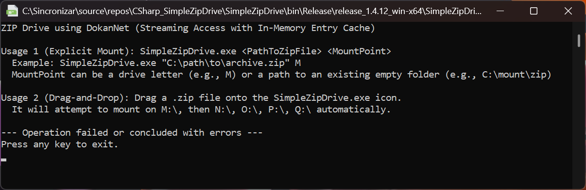

# Simple Zip Drive for Windows

[](https://dotnet.microsoft.com/download/dotnet/10.0)
[](LICENSE.txt)
[](#requirements)

**Simple Zip Drive** is a high-performance, user-mode filesystem utility that allows you to mount ZIP archives as virtual drives or NTFS directory mount points. Built on the [DokanNet](https://github.com/dokan-dev/dokan-dotnet) library, it provides seamless, read-only access to compressed data without the need for manual extraction.

Unlike traditional ZIP utilities that extract the entire archive to a temporary folder, Simple Zip Drive utilizes a **hybrid streaming engine** to minimize memory overhead and maximize random-access performance.


---

## 🚀 Key Features

*   **Virtual Drive Mounting:** Mount any ZIP file as a dedicated drive letter (e.g., `M:\`) or a folder path.
*   **Hybrid Caching Engine:** 
    *   **Small Files:** Cached in-memory for near-instantaneous access.
    *   **Large Files (>512MB):** Automatically offloaded to a temporary disk cache to prevent RAM exhaustion.
*   **Streaming Architecture:** The source ZIP is accessed via a direct file stream, supporting archives of virtually any size.
*   **Zero-Configuration UI:** Supports drag-and-drop functionality for automatic mounting to the first available drive letter (M-Q).
*   **Encrypted Archive Support:** Prompts for passwords when accessing protected ZIP files.
*   **Automated Maintenance:** Integrated update checker and automatic cleanup of temporary cache files upon unmounting.
*   **Enterprise Logging:** Comprehensive error tracking with local log rotation and remote diagnostic reporting.

---

## 🛠 Prerequisites

Before running Simple Zip Drive, ensure your system meets the following requirements:

1.  **.NET 10.0 Runtime:** Download the latest [.NET Desktop Runtime](https://dotnet.microsoft.com/download).
2.  **Dokan Library:** This application requires the Dokan kernel-mode driver.
    *   Download and install the latest `DokanSetup.exe` from the [Official Releases](https://github.com/dokan-dev/dokany/releases).

---

## 📖 Usage Guide

### Method 1: Drag-and-Drop (Recommended)
Simply drag any `.zip` file and drop it onto `SimpleZipDrive.exe`. The application will automatically attempt to mount the archive to the first available drive letter in the sequence: `M:`, `N:`, `O:`, `P:`, `Q:`.

### Method 2: Command Line Interface (CLI)
For advanced users or automation, use the following syntax:

```shell
SimpleZipDrive.exe <PathToZipFile> <MountPoint>
```

**Examples:**
*   **Mount to a drive letter:**
    ```shell
    SimpleZipDrive.exe "C:\Data\Archive.zip" M
    ```
*   **Mount to an NTFS folder:**
    ```shell
    SimpleZipDrive.exe "C:\Data\Archive.zip" "C:\Mount\MyProject"
    ```

### Unmounting
To safely unmount the drive and clean up temporary resources:
1.  Focus the console window.
2.  Press `Ctrl + C` or simply close the window.

---

## 🔍 Technical Architecture

*   **Read-Only Integrity:** The filesystem is strictly read-only. No modifications are made to the source ZIP file.
*   **Memory Efficiency:** The application does not load the entire ZIP into RAM. It reads the Central Directory into a dictionary for fast lookups and streams file data only when requested.
*   **Permissions:** Mounting to drive letters or system-protected directories may require **Administrator Privileges**. If you encounter "Access Denied" errors, right-click the executable and select "Run as Administrator."
*   **Temporary Storage:** Disk-based caching for large files occurs in `%TEMP%\SimpleZipDrive`. These files are purged automatically during a graceful shutdown.

---

## ❓ Troubleshooting

| Issue | Solution |
| :--- | :--- |
| **Dokan Initialization Failed** | Ensure the Dokan driver is installed and you have restarted your PC after installation. |
| **Drive Letter in Use** | Specify a different drive letter via CLI or ensure letters M-Q are not mapped to network shares. |
| **Out of Memory** | Occurs if too many large files are opened simultaneously. Close applications accessing the virtual drive to free up cache. |
| **ZIP File Error** | Simple Zip Drive supports standard ZIP formats. Proprietary formats like `.7z` or `.rar` are not supported. |

---

## 📜 License & Acknowledgments

This project is licensed under the **GNU General Public License v3.0**.

**Third-Party Libraries:**
*   [DokanNet](https://github.com/dokan-dev/dokan-dotnet) (MIT)
*   [SharpZipLib](https://github.com/icsharpcode/SharpZipLib) (MIT)

---

## 🤝 Support the Project

If you find this tool useful, consider supporting its continued development:

*   **GitHub:** [Star the Repository](https://github.com/drpetersonfernandes/SimpleZipDrive)
*   **Donate:** [PureLogic Code Donation](https://www.purelogiccode.com/Donate)
*   **Website:** [PureLogic Code](https://www.purelogiccode.com/)