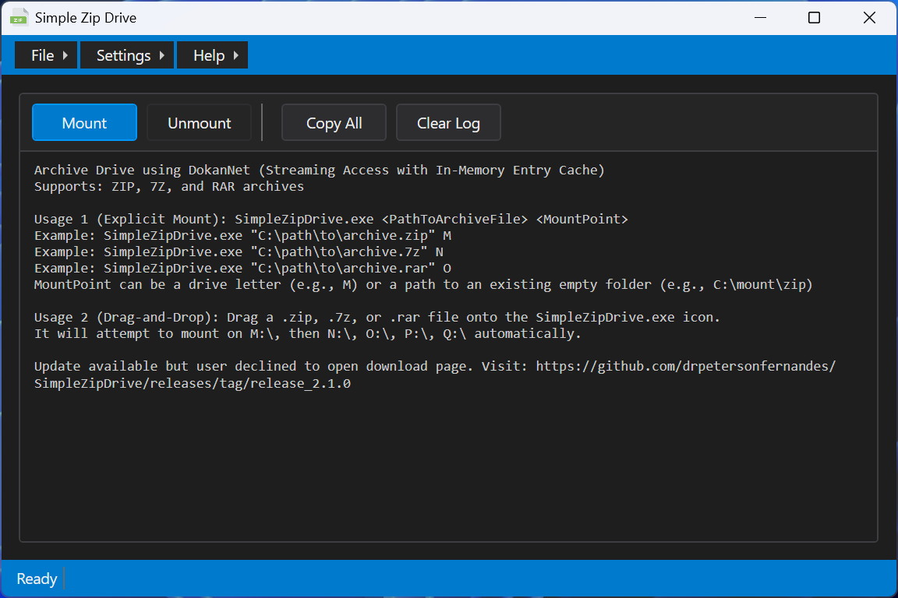

# Simple Zip Drive for Windows

[]()
[](https://dotnet.microsoft.com/download/dotnet/10.0)
[](https://github.com/drpetersonfernandes/SimpleZipDrive/releases)
[](LICENSE.txt)
[](https://github.com/drpetersonfernandes/SimpleZipDrive/releases)

**Simple Zip Drive** is a high-performance, user-mode filesystem utility that allows you to mount ZIP, 7Z, RAR, and TAR archives as virtual drives or NTFS directory mount points. It provides seamless, read-only access to compressed data without the need for manual extraction.

The solution includes two variants:
*   **SimpleZipDrive** - Built on [DokanNet](https://github.com/dokan-dev/dokan-dotnet)
*   **SimpleZipDrive_WinFsp** - Built on [WinFsp](https://github.com/winfsp/winfsp)

Unlike traditional archive utilities that extract the entire archive to a temporary folder, Simple Zip Drive utilizes a **hybrid streaming engine** to minimize memory overhead and maximize random-access performance.



---

## 🚀 Key Features

*   **Multi-Format Support:** Mount ZIP, 7Z, RAR, and TAR archives seamlessly. TAR support includes compressed variants (`.tar.gz`, `.tar.bz2`, `.tar.xz`, `.tgz`, `.tbz2`, `.txz`).
*   **Virtual Drive Mounting:** Mount any supported archive as a dedicated drive letter (e.g., `M:\`) or a folder path. The drive label automatically shows the archive name.
*   **Mount Type Choice:** Choose between drive letter or NTFS folder mounting via Settings, or use the dedicated `Mount as Drive Letter` and `Mount as Folder` menu items.
*   **Hybrid Caching Engine:**
    *   **Stored Entries (ZIP):** Uncompressed entries are read directly from the source archive with zero-copy, zero-cache performance — no RAM or disk overhead.
    *   **Small Files:** Cached in-memory for near-instantaneous access.
    *   **Large Files (≥512 MB by default):** Automatically offloaded to a temporary disk cache to prevent RAM exhaustion. The per-file memory threshold can be adjusted via the Settings window.
*   **Streaming Architecture:** The source archive is accessed via a direct file stream, supporting archives of virtually any size.
*   **Zero-Configuration UI:** Supports drag-and-drop functionality for automatic mounting to the first available drive letter (M-Q). The mounted drive label displays the archive filename.
*   **Configurable Cache:** Open `Settings > RAM Limit` to adjust the per-file RAM cache limit. The value is automatically clamped to 90% of available system memory to prevent out-of-memory errors.
*   **Configurable Mount Type:** Open `Settings` to choose the default mount type: **Drive Letter** (auto-selects M-Q) or **Folder** (browse for an NTFS directory). You can also use `File > Mount as Drive Letter` or `File > Mount as Folder` for one-time selection.
*   **Encrypted Archive Support:** Prompts for passwords when accessing protected archives.
*   **Cross-Integrity Mount (WinFsp):** When enabled in Settings, mounts archives to a folder path with a permissive security descriptor so that both standard and elevated (Administrator) processes can access the mounted drive. When SimpleZipDrive_WinFsp runs as Administrator, this mode is automatically enforced. Drive letter mounts remain isolated by Windows UAC — this is an OS limitation, not a WinFsp limitation.
*   **Screenshot Capture:** Press `F8` at any time to capture the active window and save it as a PNG in the `Screenshot` folder next to the application — handy for attaching visuals to bug reports.
*   **Automated Maintenance:** Integrated update checker (with MessageBox prompt before opening the browser) and automatic cleanup of temporary cache files upon unmounting. Also cleans up orphaned temp directories from previous sessions on startup.
*   **Enterprise Logging:** Comprehensive error tracking via a unified per-session log file and remote diagnostic reporting.

---

## 🛠 Prerequisites

Before running Simple Zip Drive, ensure your system meets the following requirements:

1.  **.NET 10.0 Runtime:** Download the latest [.NET Desktop Runtime](https://dotnet.microsoft.com/download).
2.  **Filesystem Driver** (depends on which variant you use):
    *   **For SimpleZipDrive (Dokan):** Download and install the latest `DokanSetup.exe` from the [Official Releases](https://github.com/dokan-dev/dokany/releases).
    *   **For SimpleZipDrive_WinFsp:** Download and install [WinFsp](https://github.com/winfsp/winfsp/releases).

---

## 📦 Project Variants

| Variant | Driver | Library | Notes |
|:--------|:-------|:--------|:------|
| **SimpleZipDrive** | Dokan | [DokanNet](https://github.com/dokan-dev/dokan-dotnet) | Original implementation |
| **SimpleZipDrive_WinFsp** | WinFsp | [winfsp.net](https://github.com/winfsp/winfsp) | Alternative implementation |

Both variants share the same UI and feature set; only the underlying filesystem driver differs.

---

## 📖 Usage Guide

### Method 1: Drag-and-Drop (Recommended)
Simply drag any `.zip`, `.7z`, `.rar`, `.tar`, or `.tar.gz` file and drop it onto `SimpleZipDrive.exe`. The application will automatically attempt to mount the archive to the first available drive letter in the sequence: `M:`, `N:`, `O:`, `P:`, `Q:`.

### Method 2: Menu
Use the `File` menu to mount archives:
*   **Mount Archive** (`Ctrl+M`) - Uses the default mount type from Settings.
*   **Mount as Drive Letter** - Prompts for a file, then auto-selects a drive letter.
*   **Mount as Folder** - Prompts for a file, then lets you browse for an NTFS folder.

### Method 3: Command Line Interface (CLI)
For advanced users or automation, use the following syntax:

```shell
SimpleZipDrive.exe <PathToArchiveFile> <MountPoint>
```

**Examples:**
*   **Mount a ZIP file to a drive letter:**
    ```shell
    SimpleZipDrive.exe "C:\Data\Archive.zip" M
    ```
*   **Mount a 7Z file to a drive letter:**
    ```shell
    SimpleZipDrive.exe "C:\Data\Archive.7z" N
    ```
*   **Mount a RAR file to a drive letter:**
    ```shell
    SimpleZipDrive.exe "C:\Data\Archive.rar" O
    ```
*   **Mount a TAR file to a drive letter:**
    ```shell
    SimpleZipDrive.exe "C:\Data\Archive.tar" O
    ```
*   **Mount a compressed TAR file to a drive letter:**
    ```shell
    SimpleZipDrive.exe "C:\Data\Archive.tar.gz" O
    ```
*   **Mount to an NTFS folder:**
    ```shell
    SimpleZipDrive.exe "C:\Data\Archive.zip" "C:\Mount\MyProject"
    ```

### Unmounting
To safely unmount the drive and clean up temporary resources:
1.  Click the **Unmount** button in the toolbar.
2.  Alternatively, close the application window.

### Capturing a Screenshot
Press `F8` at any time to capture the active window. The image is saved as a PNG in the `Screenshot` folder located next to the application executable. A status message confirms the saved file path.

---

## 🔍 Technical Architecture

*   **Read-Only Integrity:** The filesystem is strictly read-only. No modifications are made to the source archive.
*   **Memory Efficiency:** The application does not load the entire archive into RAM. It reads the Central Directory into a dictionary for fast lookups and streams file data only when requested. Stored (uncompressed) entries in ZIP archives bypass caching entirely using direct-read with Windows `RandomAccess` for near-zero overhead. The per-file RAM cache limit is configurable via `Settings > RAM Limit` and is automatically clamped to 90% of available system memory. A global memory cap at 90% of available free memory ensures stability even under heavy load.
*   **Permissions:** Mounting to drive letters or system-protected directories may require **Administrator Privileges**. If you encounter "Access Denied" errors, right-click the executable and select "Run as Administrator." When running as Administrator with the WinFsp variant, cross-integrity folder mount is automatically enabled so that standard user processes can access the mounted drive.
*   **Temporary Storage:** Disk-based caching for large files occurs in `%LOCALAPPDATA%\SimpleZipDrive\Temp`. These files are purged automatically during graceful shutdown, and orphaned directories from crashed sessions are cleaned up on application startup.

---

## ❓ Troubleshooting

| Issue                             | Solution                                                                                                                      |
|:----------------------------------|:------------------------------------------------------------------------------------------------------------------------------|
| **Dokan Initialization Failed**   | Ensure the Dokan driver is installed and you have restarted your PC after installation. The app detects missing drivers and offers to open the download page automatically. |
| **WinFsp Not Found**              | Install WinFsp from [GitHub](https://github.com/winfsp/winfsp/releases). The app detects missing drivers and offers to open the download page automatically. |
| **Drive Letter in Use**           | Specify a different drive letter via CLI or ensure letters M-Q are not mapped to network shares.                              |
| **Out of Memory**                 | Occurs if too many large files are opened simultaneously. Close applications accessing the virtual drive to free up cache.    |
| **Archive File Error**            | Simple Zip Drive supports standard ZIP, 7Z, RAR, TAR, and compressed TAR formats (.tar.gz, .tar.bz2, .tar.xz). Other formats like `.gz` or `.bz2` (without tar) are not supported.        |
| **Password Prompt Not Appearing** | Some encrypted archives may use unsupported encryption methods. Ensure your archive uses standard ZIP, 7Z, or RAR encryption. |
| **Drive invisible to elevated/standard processes** | This is Windows UAC isolation. Enable `Settings > Security Settings > Cross-integrity mount` (WinFsp only). When running as Administrator, this is enforced automatically. |

---

## 📜 License & Acknowledgments

This project is licensed under the GPLv3 License – see the [LICENSE](LICENSE.txt) file for details.

**Third-Party Libraries:**
*   [DokanNet](https://github.com/dokan-dev/dokan-dotnet) (MIT) - used by SimpleZipDrive
*   [WinFsp](https://github.com/winfsp/winfsp) (LGPL-3.0) - used by SimpleZipDrive_WinFsp
*   [SharpCompress](https://github.com/adamhathcock/sharpcompress) (MIT)
*   [SharpSevenZip](https://github.com/adoconnection/SevenZipExtractor) (MIT)

---

## 🤝 Contributing & Support

*   **Donate:** If you find this project useful, consider [supporting the developer](https://www.purelogiccode.com/donate).

**⭐ If you like this project, please give us a star on GitHub! ⭐**